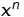

# libexponent

`libexponent` is a naive and inefficient implementation of calculating .

### Method
The implementation iteratively multiplies `x` by itself `n` times.

### Build
* `git clone git@github.com:mathinjenkins/libexponent.git`
* `cd libexponent`
* `mkdir build && cd build`
* `cmake ../`
* `make`
* `./test/exponent_test`

### License
[MIT License](https://github.com/mathinjenkins/libexponent/blob/master/LICENSE)
